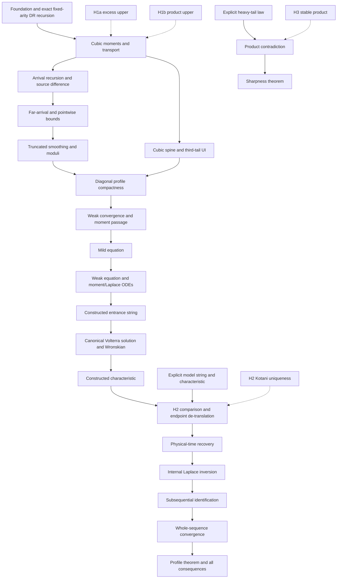

# Dependency DAG

Status: **COMPLETE** (2026-09-12 revision; compilation and axiom audit verified).

## Source-facing endpoints

| Node | Main declaration | Custom inputs |
| --- | --- | --- |
| Discrete moments | `FixedArity.cubicMoment` | H1b |
| First atom tail | `FixedArity.firstTiltedAtomTail` | H1a |
| Arrival recursion | `FixedArity.arrivalRecursion` | none |
| Source difference | `FixedArity.sourceDifference` | H1a, H1b |
| Far/pointwise/smoothing | `FixedArity.farArrivalBound`, `pointwiseBound`, `smoothing` | H1a, H1b |
| Spine/tail | `FixedArity.cubicWeightedChain`, `thirdMomentTail` | none / H1b |
| Continuum limit | `FixedArity.subsequentialLimitProperties` | H1a, H1b |
| Weak equation | `FixedArity.subsequentialHasWeakEquationOn` | H1a, H1b, H2 |
| Moment/Laplace ODE | `FixedArity.momentLaplaceODE` | H1a, H1b |
| Taylor remainder | `FixedArity.thirdOrderTaylorRemainder` | H1a, H1b |
| Identification | `FixedArity.identifySubsequentialLimit` | H1a, H1b, H2 |
| Profile | `FixedArity.profile` | H1a, H1b, H2 |
| Sharpness | `FixedArity.sharpness` | H3 |

The U46 wrapper is proved by transferring the internally verified weak equation for
the explicitly identified density.  This changes proof order, not the source claim or
trust boundary.

## Firewall

1. `HumanInputs.lean` contains exactly H1a, H1b, H2, and H3.
2. Core theorems receive published facts as explicit parameters and use only standard
   Lean axioms.
3. H1a/H1b/H2 occur only in the profile branch; H3 occurs only in sharpness.
4. The approved right-boundary correction is the topological ENNReal limit `(𝓝 ⊤)`.
5. No prior-project theorem equivalent to a target conclusion is imported.

## 2026-09-12 statement completion

`Spine.Coupling` + Ionescu–Tulcea → `Spine.InfinitePath` → `FixedArity.cubicWeightedInfiniteChain` (lem:spine, U38).

`Main.MomentLaplaceODE` + `Analysis.LocalACClosure` + fundamental theorem of calculus → `Main.MomentLaplaceRegularity` → `FixedArity.momentLaplaceLocalIntegralDerivatives` (lem:momentODE, U48).
